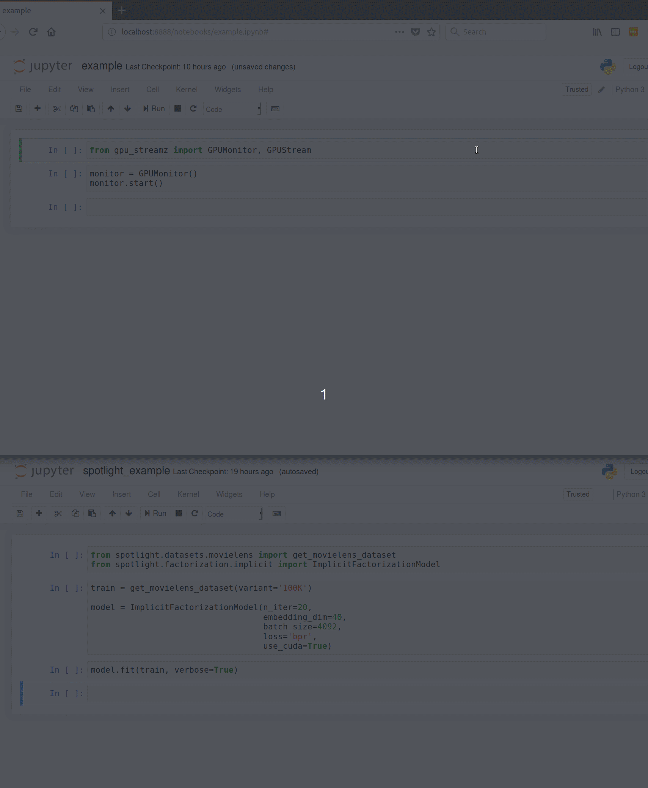

# gpu-streamz

Live GPU monitoring with [streamz](https://github.com/mrocklin/streamz)


## Installation

Note: this uses a branch of `streamz` that is not yet merged into master.

```bash
git clone https://github.com/EthanRosenthal/gpu-streamz.git
cd gpu-streamz

conda env create -f environment.yml
conda activate gpu-streamz

# Install this streamz fork
pip install -e git+https://github.com/philippjfr/streamz.git@ced72b2583292decf928fae75613c20d068ab874#egg=streamz

# Install gpu_streamz
pip install -e .
```


## Usage

The following has to be run in a separate notebook from the one in which you're running your calculations (otherwise it won't update during the calculation). 

```python
from gpu_streamz import GPUMonitor

monitor = GPUMonitor()
monitor.start()
```


